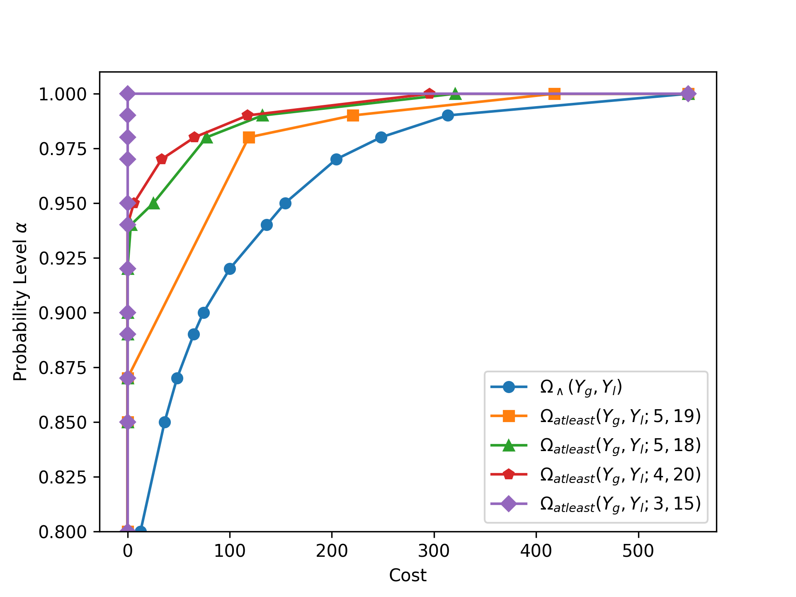

# Characterizing Event Constraints using General Disjunctive Programming
Here we provide the source code to the results presented in 
"Characterizing Event Constraints using General Disjunctive Programming" by 
Joshua L. Pulsipher, Daniel Ovalle, Hector D. Perez, Carl D. Laird, and 
Ignacio E. Grossmann. 

## Running the Code
All the results from paper were obtained using `ieee14.py` which uses 
[Pyomo](http://www.pyomo.org/) in combination with the Gurobi solver. 
The plots are generated using plot_results.py. These can be run as 
normal Python scripts. `ieee14.py` generates the data files stored in 
the `data/` folder and `plot_results.py` uses these data files to 
summarize our findings.
